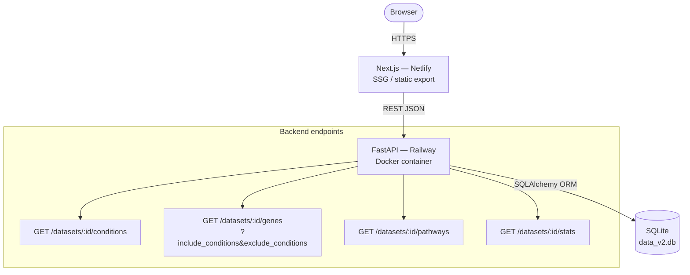

# DPDDS — Differential-expression Platform for Dynamic Diagram Studies

Interactive web platform for RNA-seq analysis of *Cobetia marina* thermal stress response. Users explore differentially expressed genes across temperature conditions (16 °C, 38 °C, 41 °C) through a dynamic three-circle Venn diagram.

**Live demo:** https://lovely-jelly-fe7bb8.netlify.app  
**API:** https://estadia-production.up.railway.app/docs

---

## Architecture



### Data model

```
datasets ──< conditions
datasets ──< genes ──< expression_results >── conditions
```

| Table | Purpose |
|---|---|
| `datasets` | One row per organism / experiment |
| `conditions` | Temperature conditions (16, 38, 41) |
| `genes` | Gene metadata (KO, accession, pathway, Brite families) |
| `expression_results` | log2FoldChange / pvalue / padj per (gene, condition) |

Venn regions are computed dynamically with set-theoretic SQL:
- **Intersection**: `HAVING COUNT(DISTINCT condition_id) = N`
- **Exclusion**: `NOT IN (SELECT gene_id … WHERE condition_id IN (exclude_ids))`

---

## Stack

| Layer | Technology |
|---|---|
| Frontend | Next.js 15, React 19, TypeScript, Tailwind CSS, shadcn/ui |
| Backend | Python 3.11, FastAPI, SQLAlchemy, SQLite, Uvicorn |
| Deploy | Netlify (frontend SSG) + Railway (backend Docker) |

---

## Local development

### Backend

```bash
cd estadia-back
pip install -r requirements.txt
cd backend
uvicorn main:app --reload --port 8000
# API docs → http://localhost:8000/docs
```

### Frontend

```bash
cd estadia-front/intento
npm install
NEXT_PUBLIC_API_BASE_URL=http://localhost:8000 npm run dev
# → http://localhost:3000
```

### Database migration (one-off)

```bash
cd estadia-back
python db/migrate.py
# Reads db/data.db (original 7-table schema) → writes db/data_v2.db (4-table schema)
```

---

## Deploy

### Railway (backend)

1. Connect repo, set **Root Directory** to `estadia-back`
2. Railway auto-detects `Dockerfile` and `railway.toml`
3. No env vars required — SQLite is bundled in the image

### Netlify (frontend)

1. Connect repo, set **Base Directory** to `estadia-front/intento`
2. Build command: `npm run build`
3. Publish directory: `out`
4. Set env var: `NEXT_PUBLIC_API_BASE_URL=https://estadia-production.up.railway.app`

---

## Repository structure

```
estadia-back/
├── backend/
│   ├── main.py           # FastAPI entry point + CORS
│   └── app/
│       ├── database.py   # SQLAlchemy engine (data_v2.db)
│       ├── models.py     # ORM models (4 tables)
│       └── routes.py     # 5 generic endpoints
├── db/
│   ├── data.db           # Original 7-table schema (source)
│   ├── data_v2.db        # Migrated 4-table schema (production)
│   └── migrate.py        # One-off migration script (stdlib only)
├── Dockerfile
├── railway.toml
└── requirements.txt

estadia-front/intento/
├── app/
│   ├── page.tsx                          # Venn diagram home
│   └── data/[section]/[element]/
│       ├── page.tsx                      # generateStaticParams
│       └── element-data-client.tsx       # Gene data table
├── lib/
│   ├── api-service.ts                    # API client (5 functions)
│   └── section-data.ts                   # sectionToConditions()
└── components/
    └── venn-diagram.tsx                  # SVG interactive diagram
```

---

## Dataset

*Cobetia marina* H68 RNA-seq — DESeq2 analysis, individual conditions vs baseline (16 °C):

| Condition | Venn region | DEGs |
|---|---|---|
| 16 °C only | A | 265 |
| 38 °C only | B | 44 |
| 41 °C only | C | 389 |
| 16 °C ∩ 38 °C | AB | 57 |
| 16 °C ∩ 41 °C | AC | 136 |
| 38 °C ∩ 41 °C | BC | 76 |
| All three | ABC | 72 |
| **Total unique genes** | **A∪B∪C** | **1039** |

---

Proyecto ANID Exploración 13220184
